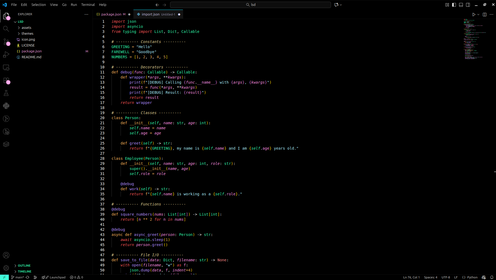
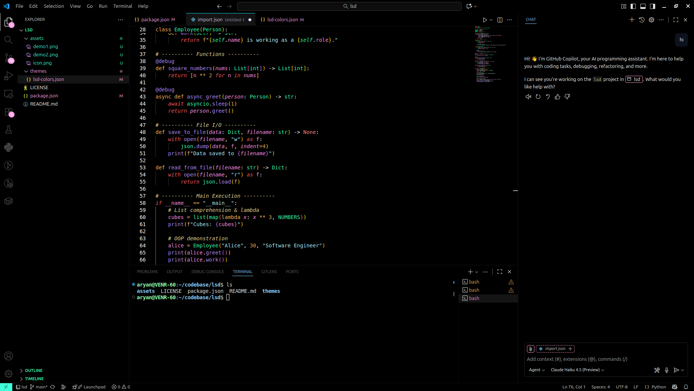
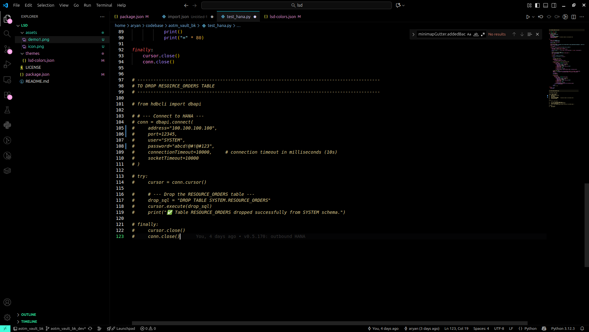

# 🌀 LSD Theme for VS Code

> A high contrast, vibrant and lucid theme for VSCode.


v1.1.0

## 🎨 LSD Preview

Quick glimpse of how the LSD theme transforms your editor:





## ✨ Features

- **Pitch Black Background** - Minimalist aesthetic with a true black (#000000) editor background
- **Vibrant Neon Colors** - Psychedelic color palette featuring:
  - Bright magenta (#ffa5e9)
  - Cyan glow (#40fdda)
  - Electric green (#52ff89)
  - Neon orange (#ffb85c)
  - And more vibrant hues
- **High Contrast** - Carefully tuned colors for maximum readability and visual impact
- **Semantic Highlighting** - Full semantic token color support for modern language features
- **Comprehensive Coverage** - Optimized colors for:
  - Syntax highlighting
  - UI elements
  - Git decorations
  - Terminal colors
  - Diff editors
  - And much more


## 🚀 Installation

### Via VS Code Extensions Marketplace

1. Open VS Code
2. Go to Extensions (Ctrl+Shift+X / Cmd+Shift+X)
3. Search for "LSD" or "psychedelic-lsd-theme"
4. Click Install

### Via Command Line

Run the following command in your terminal:

```bash
code --install-extension aryan0000.psychedelic-lsd-theme
```

Or use the quick install command in VS Code:

```
ext install aryan0000.psychedelic-lsd-theme
```


## 💿 Usage

### Activate the Theme

1. Open VS Code Command Palette (Ctrl+Shift+P / Cmd+Shift+P)
2. Type "Color Theme" and select "Preferences: Color Theme"
3. Choose "LSD" from the list

The theme will be instantly applied to your editor!


## 📜 License

This project is licensed under the MIT License. See the LICENSE file for details.

## 👨‍💻 About the Creator

**Aryan Anand**

A developer passionate about creating visually stunning and functional tools for the coding community.

- 💼 [LinkedIn](https://www.linkedin.com/in/aryananand18/)
- 🐙 [GitHub](https://github.com/aryann-anand/)
- 🌐 [Repository](https://github.com/aryann-anand/lsd)


---
